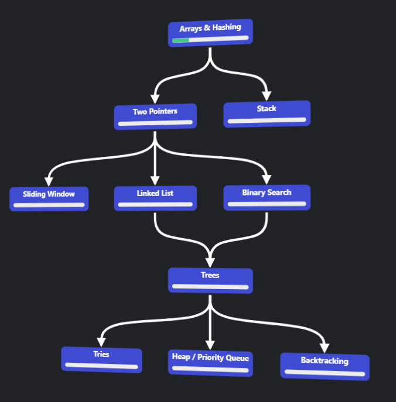

## UPDATE:  TAKING A FEW MONTHS BREAK

my competitive programming journey (yes)

  <a href="#roadmap-for-cp" style="text-decoration: none;">
    <button style="background-color: #4CAF50; color: white; padding: 15px 40px; font-size: 16px; text-align: center; border: none; border-radius: 8px; cursor: pointer; display: inline-block; box-shadow: 0 4px 6px rgba(0, 0, 0, 0.1); transition: background-color 0.3s;">
      ROADMAP FOR COMPETITIVE PROGRAMMING
    </button>    
  </a>
  <a href="#stats" style="text-decoration: none;">
    <button style="background-color: #008CBA; color: white; padding: 15px 40px; font-size: 16px; text-align: center; border: none; border-radius: 8px; cursor: pointer; display: inline-block; box-shadow: 0 4px 6px rgba(0, 0, 0, 0.1); transition: background-color 0.3s;">
      STATS
    </button>
  </a>

## Roadmap for CP

### Starting

- [1] Pattern printing problems  
- [1] Time complexity analysis  
- [1] Linear search / circular array representation  
- [✅] Palindrome and other numbers (for basic number problems)  
- [1] Hashing problems (frequency counting)  
- [✅] Prefix sum problems (1D, 2D)  
- [1] Sliding window technique {better understanding needed}  

---

### Basics of Number Theory

- [1] Binary search  
- [1] GCD of two numbers in logarithmic time (Euclidean and extended Euclidean algorithm)  
- [1] Linear Diophantine equation  
- [✅] Checking prime in \(\sqrt{n}\) complexity  
- [✅] Sieve of Eratosthenes  
- [✅] Euler's Totient Function  
- [✅] Fermat's Little Theorem  

---

### More Advanced Topics

- [] Finding \(x^n\) in \(\log[n]\)  
- [] Modular arithmetic  
- [] Modular inverse of a number  
- [] Modular exponentiation  
- [] Chinese Remainder Theorem
- [] Finding \(nCr/nPr\) for queries (constant time)  
- [] Inclusion-exclusion principle (combinatorics problem)  

---

### General Topics

- [1] Sorting algorithms (bubble, selection, insertion)  
- [] Solve a heck of a ton of problems on these to get familiar  
- [1] Problems related to the two-pointer approach  
- [1] Bit manipulation (lshift, rshift, xor, or, and, set bit, MSB, etc.)  
- [] Power set of a given array or string using bit  
- [] Number of subarrays with XOR as zero (not an algorithm, but interesting problem)  
- [] Problems related to greedy algorithm 
- [] Kadane's algorithm  
- [1] Learn recursion  

---

### After Learning Recursion

- [] In-the-middle algorithms: Solve problems related to it  
- [] Divide and conquer problems (Codeforces/leetcode)  
- [] Next greater element and next smaller element using a stack  
- [] More problems related to parentheses  
- [] Largest rectangular area in a histogram  
- [] Solve more problems related to heap priority queue  

---

### String Algorithms

*(A bit advanced, so ill do this when I'm bored)*

- [] Rolling hash functions on strings  
- [] Rabin-Karp algorithm  
- [] Prefix function  
- [] KMP algorithm  
- [] Z-function  
- [] Manacher's algorithm  

---

### Tree Algorithms

- [✅] Graph representation  
- [] DFS/BFS traversal in graph/tree  
- [] Basic stuff (diameter, height of tree, level of tree, etc.)  
- [] Euler tour of a tree  
- [] Finding LCA using Euler tour and binary lifting  
- [] Distance between two nodes  
- [] Subtree problems (SPOJ)  

---

### Graph Algorithms

- [] Connected components  
- [] Topological sort  
- [] Cycle detection in graphs  
- [] Bipartite check in graphs  
- [] SCC using Kosaraju’s algorithm  
- [] Dijkstra’s algorithm  
- [] Bellman-Ford algorithm  
- [] Bridges in graphs  
- [] Articulation point in a graph  
- [] Minimum spanning tree using Kruskal’s algorithm  
- [] Prim’s algorithm  
- [] 0/1 BFS (a big savior)  
- [] Learn finding bridges online  

---

### Dynamic Programming

- [] Solve all standard problems on DP from GFG  
- [] Solve AtCoder educational contests on dynamic programming  
- [] Solve problems from SPOJ  
- [] Google dynamic programming practice problems on Codeforces  
- [] Understand how to write recurrence for Digit DP (digit dynamic programming) and solve problems  
- [] Read about DP with bitmasks and solve problems  
- [] DP on trees  
- [] SOS DP  

---

### Range Query Algorithms

- [] Sparse table  
- [] Fenwick tree and binary lifting on Fenwick tree, solve problems  
- [] Matrix exponentiation (problems)  
- [] Sqrt decomposition technique  
- [] Update and query operations  
- [] Mo's algorithm  
- [] Mo's algorithm on trees  
- [] Segment tree  
- [] Lazy propagation on segment trees  

Apart from this,        

## Stats

CodeChef:
- Rating as of (4/12/24) : 1302
- Contests Attended : 6
- Div : 4 (on the edge to div 3)

CodeForces:
- Rating as of (4/12/24) : 369 (barely do cf, attended one contest, solved div 3 A and left)
- Contests : 1

When did I start?
- Got a roadmap for competitive programming on (15/10/24)
- Started officially grinding competitive programming on (12/10/24)

haven't done much but just gotta stay dedicated and trust the progress
